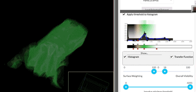

# In-browser medical volume renderer

Attempt at making a volume renderer with WebGL. There are lots of things that would be nice to add to this but are not done yet - at the moment I am not spending much time on this project, though feel free to submit issues, requests or suggestions!

See Wiki for installation / usage instructions (has many more animated gif image examples).
