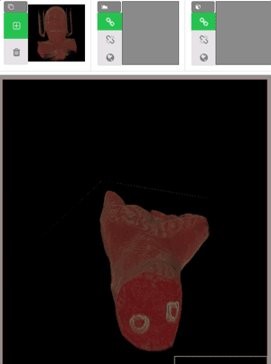
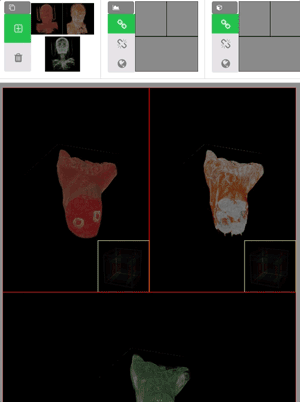
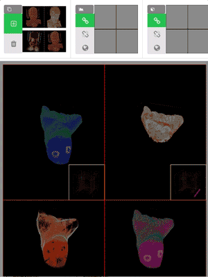
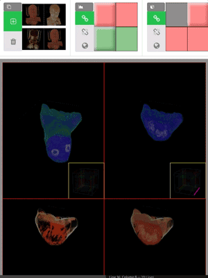
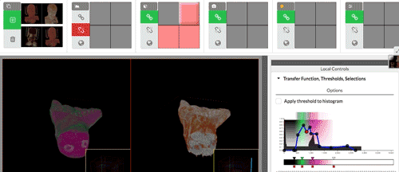

# In-browser medical volume renderer

## Table of contents:

* [Windowing operations](#WindowingOperations)
    * [Adding and removing subviews](#AddSubview)
    * [Linking and unlinking properties between subviews](#Linking)
    * [Local vs global controllers](#LocalVsGlobal)
    * [Selecting a subview](#SelectSubview)
    
* [Changing appearance of the volume](#VolumeAppearance)
    * Transfer Function 
    * Thresholds & Histogram
    * Lighting 
    * Camera settings (Toggle ortho & perspective)

* [Interacting with the volume](#Interacting)
    * Camera navigation (Rotate, zoom & move)
    * Slicing
    * Selecting a ray

## [Windowing Operations](#WindowingOperations)

## 
    Adding a subview:

    Removing a subview:

  
  
## 
    Linking properties between subviews:

  
## 
    Setting properties to global:

## 
    Selecting a local subview:

  
  
  
## [Volume Appearance](#VolumeAppearance)
## [Interacting](#Interacting)

Global vs local controllers
Selecting subview for local controller

VIEW OPERATIONS:
*Adding/removing subviews
*Linking/unlinking properties between subviews
*Linking properties to global
*Setting a preset for a subview

SLICER:
*Moving slices
*Rotating slicer

DATASETS:
*Loading a dataset

TRANSFER FUNCTION:

    Opacity:
        *Adding control points
        *Removing control points
        *Dropping control point to bottom

    Color gradient:
        *Adding control points
        *Removing control points
        *Moving control points

    *Surface weighting
    *Overall opacity

    *Apply threshold to histogram
    *ISO-THRESHOLD

LIGHTS:
    
    Ambient
    Diffuse
    Specular Power
    Specular Shininess
    Lighting Range

SELECTION SETTINGS:

    Ray radius
    Clear ray
    Non-selected visibility

CAMERA SETTINGS:
    
    Toggle ortho / perspective
    Reset zoom

3D Interaction
    Rotate, move, zoom
    Select ray

