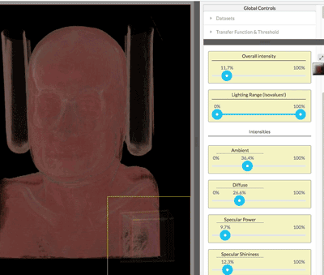

# In-browser medical volume renderer

## Table of contents:

* [Loading a dataset](#DatasetLoading)
* [Windowing operations](#WindowingOperations)
    * [Adding and removing subviews](#AddSubview)
    * [Linking and unlinking properties between subviews](#Linking)
    * [Local vs global controllers](#LocalVsGlobal)
    * [Selecting a subview](#SelectSubview)
    
* [Changing appearance of the volume](#VolumeAppearance)
    * [Transfer Function](#TransferFunction)
        * [Adjusting opacity](#AdjustOpacity)
        * [Adding a control point](#AddPoint)
        * [Deleting a control point](#DeletePoint)
        * [Dropping a control point](#DropPoint)
        * --
        * [Adding a color gradient control point](#AddCGControlPoint)
        * [Deleting gradient control point](#DeleteCGControlPoint)
        * [Moving a color gradient control point](#MoveCGControlPoint)
        * [Changing color of a color gradient control point](#ChangeCGControlPoint)
        * --
    * [Thresholds & Histogram](#Histogram)
        * [Surface weighting](#SurfaceWeighting)
        * [Overall visibility](#OverallVisibility)
        * [Isovalue threshold & histogram](#HistogramThreshold)
        * --
    * Lighting(#Lighting)
        * [Intensity](#Intensity)
        * [Lighting isovalue threshold](#LightThreshold)
        * [Ambient](#Ambient)
        * [Diffuse](#Diffuse)
        * [Specular](#Specular)
    * [Camera settings (Toggle ortho & perspective)](#Camera)

* [Interacting with the volume](#Interacting)
    * [Camera navigation (Rotate, zoom & move)](#CameraSettings)
    * [Slicing](#InteractSlicer)
    * [Selecting a ray](#SelectRay)

## [Dataset Loading<a name="DatasetLoading"></a>](#DatasetLoading)
```
    Loading a dataset:
```


## [Windowing Operations<a name="WindowingOperations"></a>](#WindowingOperations)

## <a name="AddSubview"></a>
```
    Adding a subview (Click):
```


```
    Removing a subview (Click):
```


  
## <a name="Linking"></a>

```
    Linking properties between subviews (Click, move and click):
```


  
## <a name="LocalVsGlobal"></a>
```
    Setting properties to global (Click to toggle):
```


## <a name="SelectSubview"></a>
```
    Selecting a local subview (Click to select):
```


  
  
## [Volume Appearance<a name="VolumeAppearance"></a>](#VolumeAppearance)

## <a name="TransferFunction"></a> Transfer Function
# <a name="AdjustOpacity"></a>
```
    Adjusting opacity (Drag)
```


# <a name="AddPoint"></a>
```
    Adding a control point (Click)
```


# <a name="DeletePoint"></a>
<br>
--
<br>
```
    Deleting a control point (Double click)
```


# <a name="DropPoint"></a>
<br>
--
<br>
```
    Dropping a control point (Single click)
```


# <a name="AddCGControlPoint"></a>
<br>
--
<br>
```
    Adding a color gradient control point (Click on the gradient below)
```


# <a name="DeleteCGControlPoint"></a>
<br>
--
<br>
```
    Deleting gradient control point (Click on the cross below the control point)
```


# <a name="MoveCGControlPoint"></a>
<br>
--
<br>
```
    Moving a color gradient control point (Drag a triangle)
```


# <a name="ChangeCGControlPoint"></a>
<br>
--
<br>
```
    Changing color of a color gradient control point (Double-Click on triangle & select color)
```


## <a name="Histogram"></a> Histogram And Thresholds

# <a name="SurfaceWeighting"></a>

```
    Surface weighting (Higher weighting = more prominent surfaces and less prominent non-surfaces)
```


<a name="OverallVisibility"></a>
<br>
--
<br>
```
    Modifying overall visibility (It is useful to adjust this UP and surface weighting is adjusted up)
``` 


<a name="HistogramThreshold"></a>
<br>
--
<br>
```
    Histogram & Thresholds (Drag slider to adjust displayed range of isovalues)
```


# [Lighting<a name="Lighting"></a>](#Lighting)
<a name="Intensity"></a>
<br>
--
<br>
```
Adjust intensity (Adjusts all light components)
```



<a name="LightThreshold"></a>
<br>
--
<br>
```
Lighting range (select which isovalues to apply lighting to)
```


<a name="Ambient"></a>
<br>
--
<br>
```
Adjust ambient (High ambience makes color more prominent)
```


<a name="Diffuse"></a>
<br>
--
<br>
```
Adjust diffuse lighting
```


<a name="Specular"></a>
<br>
--
<br>
```
Adjust specular lighting 
```


# [Camera<a name="Camera"></a>](#Camera)
<br>
```
Toggle ortho and perspective
```


## [Interacting<a name="Interacting"></a>](#Interacting)


<a name="#CameraSettings"></a>
--

```
Camera operations - (Move, rotate, zoom)
```


<a name="#InteractSlicer"></a>
<br>
--
<br>
```
Slicing the volume (Drag a slice along the edges of the box)
```


<a name="#SelectRay"></a>
<br>
--
<br>
```
Selecting a ray
```


